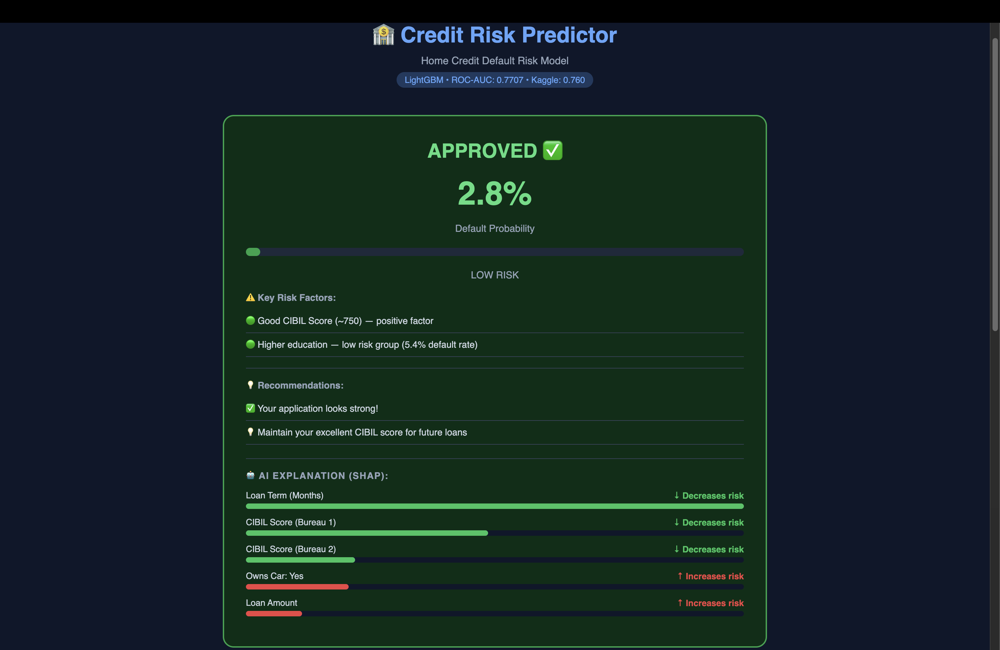
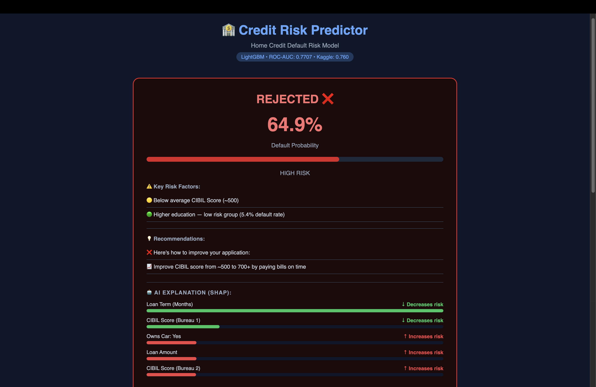
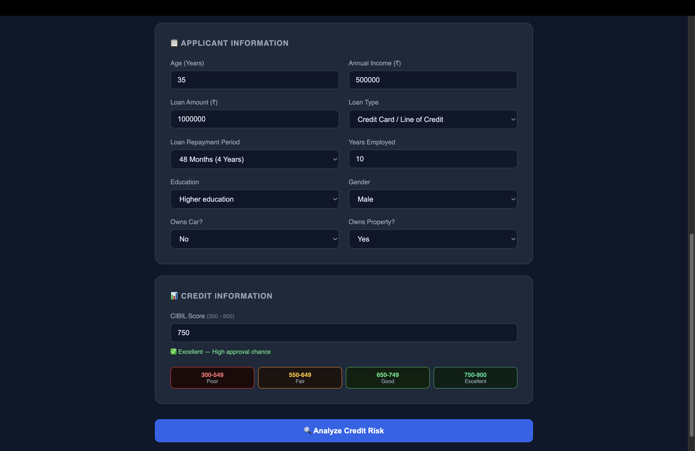

# 🏦 Credit Risk Scoring System


## 🔴 Live Demo
👉 **[Try Credit Risk Predictor](https://credit-risk-scoring-api-xure.onrender.com)**

## 📌 Problem Statement

Home Credit is a loan company serving 
unbanked population — people with no 
traditional credit history.

**Business Challenge:**
- Missing a defaulter → Financial loss for bank
- Rejecting safe applicant → Business loss

**Goal:** Build an explainable ML model that 
accurately predicts loan default probability.

---

### ✅ Approved Application


### ❌ Rejected Application


### 📋 Application Form


---

## 🎯 Model Performance Journey

| Step | What I Did | ROC-AUC |
|------|-----------|---------|
| Baseline | Basic XGBoost, raw features | 0.724 |
| + Feature Engineering | EXT_SOURCE_MEAN, CREDIT_TERM etc. | 0.749 |
| + Bureau Data | Past loan history added | 0.751 |
| + Hyperparameter Tuning | Optuna 50 trials | 0.760 |
| Final Model | LightGBM + All improvements | **0.7707** |

**Kaggle Public Score: 0.7600 — Top 35% globally**

## 📊 Dataset

| Detail | Info |
|--------|------|
| Source | Kaggle — Home Credit Default Risk |
| Train rows | 307,507 |
| Original features | 122 |
| Final features | 85 |
| Default rate | 8.07% (Imbalanced) |

---

## 🔬 My Approach

### 1️⃣ Data Cleaning
- **43 columns removed** 
  (missing values > 60%, duplicates, correlations > 0.95)
- **Key fixes:** DAYS_EMPLOYED anomaly, 
  outliers, gender XNA values
- **Missing values:** Categorical → Mode, 
  Numerical → Median
- **Result:** 122 → 79 features

### 2️⃣ Feature Engineering

**New features created: 8**

| Feature | Logic | Impact |
|---------|-------|--------|
| EXT_SOURCE_MEAN | Avg of 3 credit scores | 0.099 → 0.221 |
| EXT_SOURCE_MIN | Weakest credit score | 0.193 corr |
| EXT_MEAN_X_AGE | Credit score × Age | 0.167 corr |
| CREDIT_TERM | Loan duration months | New feature |
| SOCIAL_CIRCLE_RISK | % defaulters in circle | Risk signal |

**Feature Selection:**
- Started: 122 → Final: 85
- Method: Correlation analysis + Business logic
- Dropped weak features (<0.02 correlation)

### 3️⃣ Model Building
- **Algorithm:** LightGBM
- **Imbalance:** scale_pos_weight = 11.39
- **Tuning:** Optuna — 50 trials
- **Threshold:** 0.35 (optimized for recall)

### 4️⃣ Explainability (SHAP)
- Individual prediction explanation
- Top 5 contributing features shown
- Red bars = increases default risk
- Green bars = decreases default risk

---

## 💡 Key Business Insights

CIBIL Score = Strongest predictor
Safe borrowers avg: 0.524
Defaulters avg    : 0.411

Age matters significantly
20-25 age group → 12.3% default (Riskiest!)
60-70 age group →  4.9% default (Safest)

Education = Strong social predictor
Academic degree  → 1.8% default
Lower secondary  → 10.9% default

Income alone = Weak predictor
Correlation: only 0.004
EMI-to-income ratio matters more!

Gender bias intentionally removed Ethical AI practice

## 🛡️ Input Validations

| Validation | Rule | Reason |
|------------|------|--------|
| Age | 18 - 100 years | Working age limit |
| Annual Income | Min ₹50,000 | Minimum repayment capacity |
| Loan Amount | ₹10,000 - ₹1 Crore | Practical loan range |
| Monthly EMI | Max 50% of monthly income | RBI guideline |
| Employment | Cannot exceed working age | Data sanity |
| Loan/Income ratio | Max 10x annual income | Risk control |
---

## 🚀 API Endpoints
GET  /        → Web UI
GET  /health  → API health check
GET  /docs    → Auto API documentation
POST /predict → Loan risk prediction

### Sample Request:
```json
{
  "age": 35,
  "income": 500000,
  "loan_amount": 500000,
  "credit_term": 36,
  "employed_years": 5,
  "education": "Higher education",
  "gender": "F",
  "own_car": "N",
  "own_realty": "Y",
  "ext_source_1": 0.67,
  "ext_source_2": 0.67,
  "ext_source_3": 0.67
}
```

### Sample Response:
```json
{
  "status": "success",
  "probability": 0.094,
  "risk_percent": "9.4%",
  "risk_level": "LOW RISK",
  "decision": "APPROVED ✅",
  "risk_factors": [
    "🟢 Good CIBIL Score (~700)",
    "🟢 Higher education — low risk"
  ],
  "suggestions": [
    "✅ Your application looks strong!",
    "💡 Improve CIBIL to 750+ for better terms"
  ],
  "shap_explanation": [...]
}
```

---

## 🛠️ Tech Stack

| Category | Technology |
|----------|-----------|
| ML Model | LightGBM, XGBoost |
| Explainability | SHAP |
| Hyperparameter Tuning | Optuna |
| API Backend | FastAPI + Uvicorn |
| Frontend | HTML / CSS / JavaScript |
| Deployment | Render |
| Data Processing | Pandas, NumPy |
| Visualization | Matplotlib, Seaborn |

---

## 📁 Project Structure
home-credit-risk-api/
│
├── app.py                 # FastAPI backend

├── index.html             # Frontend UI

├── model.pkl              # Trained model

├── feature_names.json     # Feature names

├── requirements.txt       # Dependencies

├── screenshots/           # UI screenshots

└── README.md              # Documentation

---

## ⚙️ Local Setup

```bash
# 1. Clone karo
git clone https://github.com/JayDaslani/Credit-risk-scoring-api.git
cd Credit-risk-scoring-api

# 2. Virtual environment
python -m venv venv
source venv/bin/activate  # Mac/Linux

# 3. Dependencies install karo
pip install -r requirements.txt

# 4. Server start karo
uvicorn app:app --reload

# 5. Browser mein kholo
# http://localhost:8000
```

---

## 🔗 Links

| Resource | Link |
|----------|------|
| Live Demo | https://credit-risk-scoring-api-xure.onrender.com |
| Kaggle Competition | https://www.kaggle.com/competitions/home-credit-default-risk |
| Dataset | https://www.kaggle.com/competitions/home-credit-default-risk/data |
